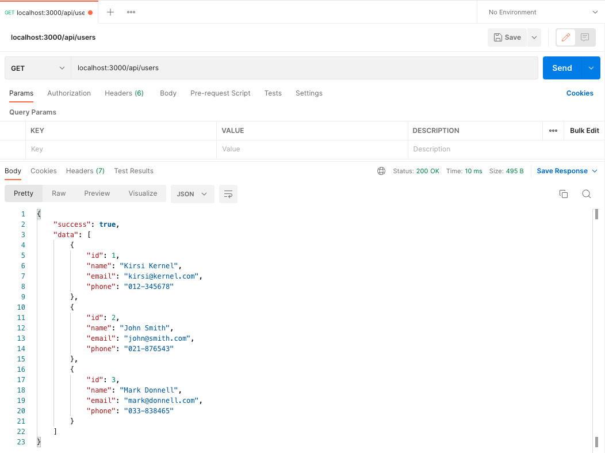
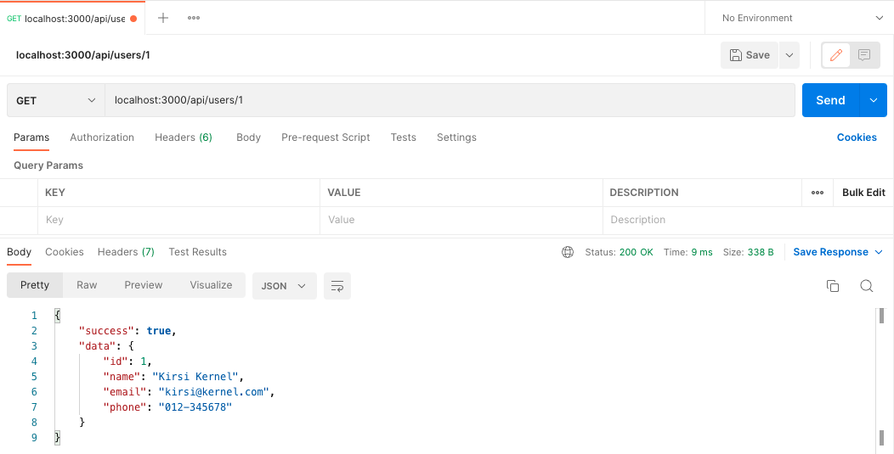
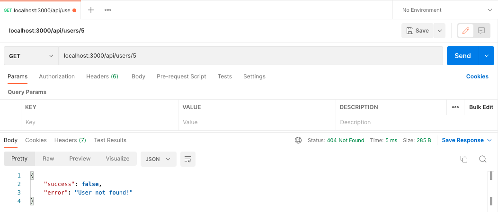
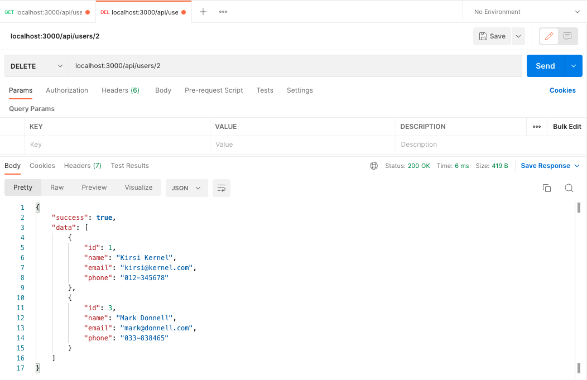
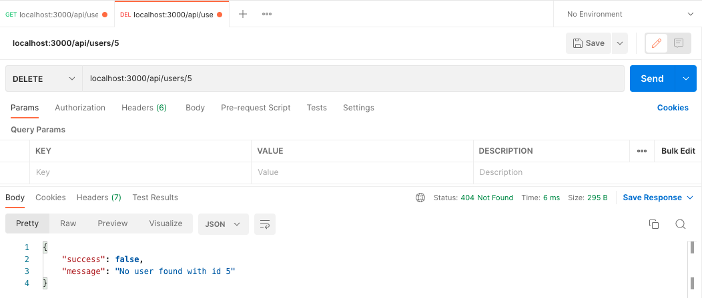
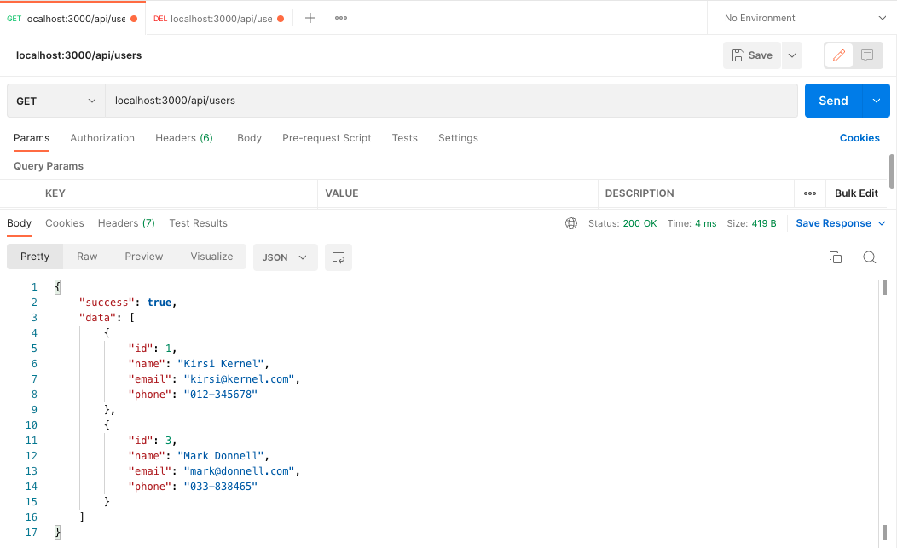

# REST API

Here is a simple chart of basic REST APIs you will make for your users application:

| Resource       | GET read                | POST create       | PUT update              | DELETE                  |
| -------------- | ----------------------- | ----------------- | ----------------------- | ----------------------- |
| /api/users     | Returns a list of users | Create a new user | -                       | -                       |
| /api/users/:id | Returns a specific user | -                 | Updates a specific user | Deletes a specific user |

## Step 1

Create a folder `users-api`. Install Express and Nodemon by issuing the following commands inside `users-api`

```sh
npm init -y
npm i express
npm i --save-dev nodemon
```

## Step 2

- Create a `.gitignore` file and add the following content: `node_modules/`.

## Step 3

Create a new file `data.js` with the following content.

```js
const users = [
  {
    id: 1,
    name: 'Kirsi Kernel',
    email: 'kirsi@kernel.com',
    phone: '012-345678',
  },
  {
    id: 2,
    name: 'John Smith',
    email: 'john@smith.com',
    phone: '021-876543',
  },
  {
    id: 3,
    name: 'Mark Donnell',
    email: 'mark@donnell.com',
    phone: '033-838465',
  },
];

module.exports = { users };
```

## Step 4

Create an `app.js` file with the following content:

```js
const express = require('express');
const app = express();
const port = 3000;

// use sample users data
let { users } = require('./data.js');

app.use(express.json());

app.get('/api/users', (req, res) => {
  res.status(200).json({ success: true, data: users });
});

app.listen(port, () => {
  console.log(`Server listening on port ${port}...`);
});
```

## step 5

Edit your `package.json` and create 2 scripts: start and dev as follows.

```sh
"scripts": {
    "start": "node app.js",
    "dev": "nodemon app.js",
    //...
  },
```

To start your project, try the following commands. What is the difference between them?

- `npm run start`
- `npm run dev`

## Step 6: GET all the users (cRud)

- Create a new API endpoint (route) to handle GET request and return all the users. Add the following content to `app.js`.

```js
app.get('/api/users', (req, res) => {
  res.status(200).json(users);
});
```

- Modify the code above as follows and notice the difference!

```js
app.get('/api/users', (req, res) => {
  res.status(200).json({ success: true, data: users });
});
```

- Test `GET` request to [http://localhost:3000/api/users/](http://localhost:3000/api/users/) with **Postman** or a browser. You should see the returned JSON data.
  

## Step 7: GET one user (cRud)

- Create a new API endpoint to handle single user with GET request. Add the following content to `app.js`.

```js
app.get('/api/users/:id', (req, res) => {
  const { id } = req.params;
  const user = users.find((user) => user.id === id);
  if (user) res.status(200).json({ success: true, data: user });
  else res.status(404).json({ success: false, error: 'User not found!' });
});
```

- Test `GET` request to [http://localhost:3000/api/users/1](http://localhost:3000/api/users/1) with **Postman** or a browser.

There is a bug in the code above and it should not work. To correct it make the following modification:

- Change this line:

```js
const user = users.find((user) => user.id === id);
```

As follows:

```js
const user = users.find((user) => user.id === Number(id));
```

> Note: You will need to use `:` to add parameters to route path.

- Test GET request to http://localhost:3000/api/users/1 with a **Postman** or browser. You should see the returned user JSON data.



Remember test also id which doesn't exists.



The user's data will be returned to the caller or 404 status code with error message if user can not be found.

## Step 8: DELETE one user (cruD)

- One user can be deleted with using HTTP DELETE request. Add the following content to `app.js`.

```js
app.delete('/api/users/:id', (req, res) => {
  const { id } = req.params;
  // find user
  const user = users.find((user) => user.id === Number(id));
  // user not found
  if (!user) {
    return res
      .status(404)
      .json({ success: false, message: `No user found with id ${id}` });
  }
  // filter user with id away from users collection
  users = users.filter((user) => user.id !== Number(id));
  // return users
  res.status(200).json({ success: true, data: users });
});
```

- Test DELETE request to http://localhost:3000/api/users/2 with a **Postman**.



- Use DELETE request to try to delete user that doesn't exists.



- Finally request all the users again to see changes.



## Step 9: PUT user data (crUd)

- You can use PUT request to update user data in server side. Add the following content to `app.js`.

```js
app.put('/api/users/:id', (req, res) => {
  const id = req.params.id;
  const { name, email, phone } = req.body;
  const user = users.find((user) => user.id === Number(id));

  // if user not found
  if (!user) {
    return res
      .status(404)
      .json({ success: false, message: `No user found with id ${id}` });
  }
  // update user data
  user.name = name;
  user.email = email;
  user.phone = phone;
  res.status(200).json({ success: true, data: users });
});
```

- Change request type to PUT
- Use http://localhost:3000/api/users/1 route
- Select body and raw to write use JSON data
- Select JSON data type
- Write user as JSON data

<!--
````http
PUT http://localhost:3000/api/users/1
```
-->

```json
{
  "name": "matti ",
  "email": "matti@gmail.com"
}
```

## Step 10: POST user data (Crud)

You can use POST request to add a new user data in server side. Add the following content to `app.js`.

```js
app.post('/api/users/', (req, res) => {
  // get user from request
  const user = req.body;
  //   console.log(user);
  if (!user.name) {
    return res
      .status(400)
      .json({ success: false, msg: 'No user value provided!' });
  }
  // add a new user
  user.id = id++;
  users = users.concat(user);
  res.status(201).json({ success: true, data: users });
});
```

The new user will be added to users with JavaScript arrays `concat()` function.

Use Postman to send POST request to server side. Use JSON data, and include it in the request body.

- Change request type to POST
- Use http://localhost:3000/api/users/ route
- Select body and raw to write use JSON data
- Remember select JSON data type
- Write user as JSON data

```json
{
  "name": "Matti V",
  "email": "matti@gmail.com",
  "phone": "040-2022332"
}
```

In the server side, data will be inside `request.body` object. You can use Express JSON parser to get it easily. `express.json()` is a built-in middleware in Express. Express JSON parser will parse the incoming JSON data (inside request) to JSON object.

```js
const express = require('express');
const app = express();
app.use(express.json());
///...
```

> in this example data is not persistent as was the case with JSON server. Next week we will interact with a database.

## Reference

https://ytsp0200.pages.labranet.jamk.fi/05.-Express/03.-REST.Example/
