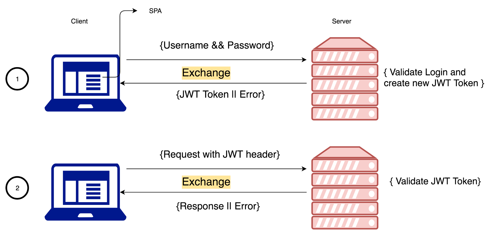

# Readme

## Activity 1

Inside the `src` directory

1. create a file `.env` and add the following content:

```text
MONGODB_URI=YOUR_DB_URI
PORT=4000
SECRET=mysecretepassword
```

2. Run:

```sh
npm install
npm run dev
```

3. Test the endpoints with POSTMAN. refer to the following figure.



## Activity 2

With respect to your project, discuss how to:

- Generate API documentation
- Add new models, routes and controllers
- Front end (Client)
